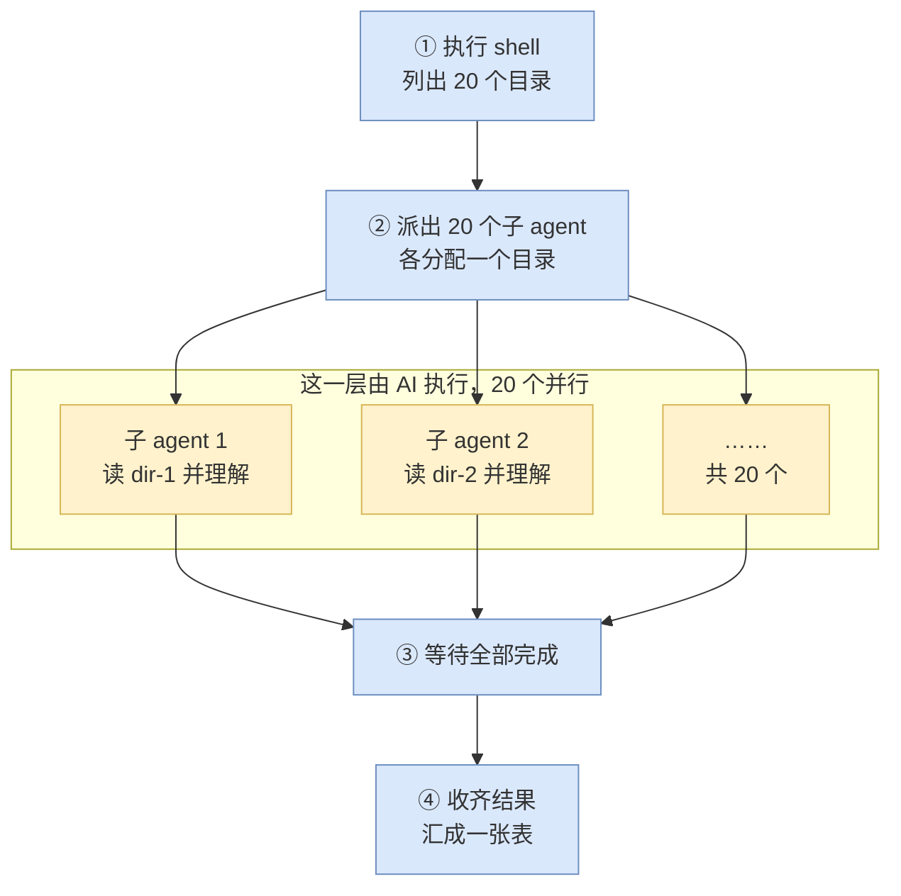
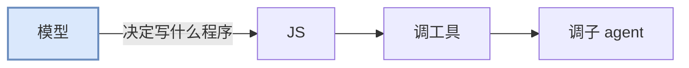
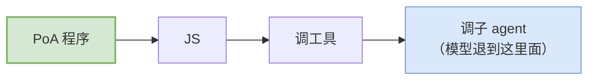

# 概览

PoA（Program of Agent）是 brainary 提供的一条通道：用普通 JavaScript 驱动一批 AI agent。将调度、分发、汇总、判定等固定性的业务逻辑，写在程序代码里。

---

## 1. 编排循环在谁那里

一个陌生仓库，根目录下有 20 个子目录，需要查明每个目录的用途、对外接口和依赖，最后汇成一张表。五种做法的区别不在是否使用 AI，而在编排循环由谁执行：

| 做法 | 编排由谁执行 | 结果 |
| --- | --- | --- |
| 脚本：grep + 统计 | 程序 | 能统计文件数与依赖，但回答不了"这个模块的用途是什么"，那需要读懂代码 |
| codex + 常规工具调用 | 模型 | 每读一个目录即一次采样，20 个目录需要二十余轮；每份原始输出都进入上下文；且每次运行选取的步骤可能不同 |
| codex + code mode，由模型写 JS | 模型 | 循环与统计收进了程序，采样降到一次；但这段 JS 由模型现场生成，编排逻辑仍不确定 |
| 自建编排框架（LangGraph、CrewAI 等） | 开发者 | 编排确定，但 agent 是自己拼的：工具面、沙箱、审批各自实现 |
| PoA | 开发者 | 编排是预先写定的代码，且直接跑在 codex 的工具面与沙箱上 |

前两行是两个极端：脚本有确定性但读不懂代码，模型读得懂但编排不确定。PoA 采用第三行的机制和第一行的确定性——一段普通的 JavaScript 派出 20 个子 agent，每个负责一个目录，再收回结果汇总。

后两行的差别见 §2。



蓝色四步是普通的程序代码，黄色一层才是 AI。分工如下：

- **判断交给 AI**："这个模块的用途是什么"只有读懂代码才能回答
- **调度、汇总、判定交给程序**：派多少个 agent、各自负责什么、结果如何合并，都是普通的 `for` / `if` / `Promise.all`

---

## 2. 控制方向，以及与自建编排框架的分工

模型走 code mode 时，模型是决策者，那段 JS 是模型的产物：



PoA 的方向相反：程序由开发者编写，模型只负责每个子 agent 内部的工作。



---

## 3. 接入位置：codex 的 code mode

PoA 跑在 codex 的 code mode 上，不是另一套执行环境。

codex 向模型投送工具有三种形态：

| 形态 | 模型看到的 | `exec` 说明 | 编排循环在哪 |
| --- | --- | --- | --- |
| Direct | 各个直接工具 | 无 `exec` | 模型的推理中。调 10 个工具即 10 次采样 |
| ordinary CodeMode | 直接工具 + `exec` | 运行时基础说明；存在 `Deferred` nested tools 时附通用 `ALL_TOOLS` 查询提示；不展开 nested declarations 或共享 MCP 类型 | 直接工具仍由模型编排；`exec` 内的调用由 V8 程序编排 |
| CodeModeOnly | `exec`；`wait` 与 `DirectModelOnly` 工具仍独立可见 | 展开非 `Deferred` nested tools 的 per-tool declarations；存在 MCP 时再附一次共享 MCP 类型块；存在 `Deferred` 时只提示查 `ALL_TOOLS` | nested tools 的循环在 V8 程序中 |

PoA 借的是 CodeMode 的 cell 执行路径。ordinary 与 CodeModeOnly 都在程序里按普通异步函数调用 nested tools：

```js
const r = await tools.exec_command({ cmd: "ls -d */" });
```

模型发出一次 `exec`，参数是一段 JavaScript。这段 JS 在沙箱内循环、分支、并发地调用这些工具，只把整理后的结果交回模型；中间的 `ls` 原始输出不进入上下文。

### 提交入口

模型走这条路时，那段 JavaScript 由它自己生成。

PoA 用的是同一条路上的另一个入口：模型以外的调用方也能提交这段 JS。

```
thread/codeMode/exec   { threadId, package }  →  { output }
```

`package` 是一个 base64 编码的 `.poa` 包，即一个 zip，根目录放 `manifest.toml`，内含程序本体与随包分发的文件。

这个接口只接受包，不接受裸源码。

> 只持有一段 JS、没有任何需要随行的能力时，仍需先封装成一个不申报任何能力的最小包再提交。

从这个入口进入之后，运行环境与模型同源：同一个沙箱、同一批工具、同一条分发路径与记录。

当前各入口的支持情况：

| 入口 | 状态 |
| --- | --- |
| `codex exec --poa <目录或 .poa 文件>` | 可用。日常开发与分发都走这条 |
| `codex app-server` 的 `thread/codeMode/exec` | 可用，自研客户端走这条。|
| TUI 交互界面 | 暂不支持 |
| SDK（TypeScript / Python） | 暂不支持 |
| `codex mcp-server` | 暂不支持。 |

---

## 4. 程序的典型形状

一个完整的 PoA 程序通常是以下形状：

首行那条 `// @exec:` 注释是这次运行的配置，必须在第 1 行：`yield_time_ms` 是本次运行的整体超时，`max_output_tokens` 是返回值的 token 预算，两者默认都只有 10000。

```js
// @exec: {"yield_time_ms": 900000, "max_output_tokens": 30000}

// ① 程序自行发现工作
const folders = await shellLines("ls -d */ | sed 's#/$##'", {
  validate: (line) => SAFE_NAME.test(line),
});

// ② 程序决定分发方式
const batch = await runBatch(
  folders.map((folder, i) => ({
    message: prompt(folder),
    name: `scan_${i}`,
    meta: { folder },           // ← 记录结果与输入的对应关系
  })),
  { concurrency: 3 },
);

// ③ 程序自行收口
text(JSON.stringify(batch.map(({ handle, reply }) => ({
  folder: handle.meta.folder,
  summary: parseJsonReply(reply).value,
}))));
```

`ls` 由程序执行，分发由程序决定，join 由程序编写。模型只负责每个 agent 内部的工作。

`shellLines` / `runBatch` / `parseJsonReply` 来自 prelude；来源与使用规则见《03-concepts.md》§2。

逐行讲解见《05-writing.md》§0–§7。

---

## 5. 三个前提约束

**①** PoA 程序运行在一个精简的 V8 沙箱中。没有 Node、没有文件系统 API、没有网络，也没有 `console.log`。但 `tools.exec_command` 提供了一个真实的 shell，因此"没有文件系统"仅指 JS 层面，读写文件仍然可以通过命令完成。

**②** 程序能传给子 agent 的只有一段任务文字。系统提示词无法修改。

**③** 文本输出只有 `text()` 一条路径。中间过程全部留在沙箱内，只有主动写入返回值的内容才会返回。`image()` / `audio()` / `generatedImage()` 也会进入返回值（渲染成 `[input_image] …` 这样的一行摘要），但它们不是文本通道，供人阅读的正文仍然只能通过 `text()` 输出。
