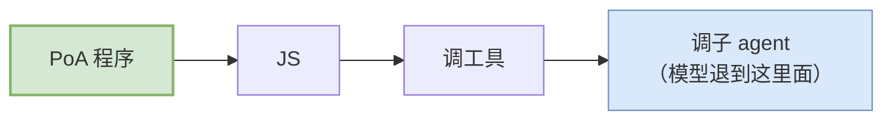

# 概览

## 1. 一个具体场景

设想这样一项任务：一个陌生仓库，根目录下有 20 个子目录，需要弄清每个目录是干什么的、对外暴露什么接口、依赖了什么，最后汇成一张表。

四种做法，差别不在用不用 AI，而在编排循环待在谁那里：

| 做法 | 编排由谁做 | 问题 |
| --- | --- | --- |
| 写个脚本 grep + 统计 | 程序 | 能数出文件数和依赖，但答不了"这个模块是干什么的"，那需要读懂代码 |
| 交给 codex，用普通的工具调用 | 模型 | 每读一个目录就是一次采样，20 个目录来回二十几轮；每份原始输出都堆进上下文；而且每次跑，它挑的步骤都可能不一样 |
| 交给 codex，让它在 code mode 里写一段 JS | 模型 | 循环和统计收进了程序，采样降到一次；但那段 JS 是模型现场编的，编排逻辑依然不确定 |
| **PoA** | 开发者 | 编排就是写死的代码：零模型调用、每次行为一致 |

前两行是两个极端：脚本有确定性但读不懂代码，模型读得懂但编排不确定。PoA 取的是第三行的机制、第一行的确定性——一段普通的 JavaScript 派出 20 个 AI 助手，每个负责一个目录，再把结果收回来汇总。

```mermaid
graph TD
    S1["① 跑 shell<br/>列出 20 个目录"] --> S2["② 派出 20 个助手<br/>每人分一个目录"]

    subgraph AI["这一层是 AI 在干活，20 个同时进行"]
      A1["助手 1<br/>读 dir-1，理解它"]
      A2["助手 2<br/>读 dir-2，理解它"]
      AN["……<br/>共 20 个"]
    end

    S2 --> A1
    S2 --> A2
    S2 --> AN
    A1 --> S3["③ 等它们全部完成"]
    A2 --> S3
    AN --> S3
    S3 --> S4["④ 收齐结果<br/>汇成一张表"]

    style S1 fill:#dae8fc,stroke:#6c8ebf
    style S2 fill:#dae8fc,stroke:#6c8ebf
    style S3 fill:#dae8fc,stroke:#6c8ebf
    style S4 fill:#dae8fc,stroke:#6c8ebf
    style A1 fill:#fff2cc,stroke:#d6b656
    style A2 fill:#fff2cc,stroke:#d6b656
    style AN fill:#fff2cc,stroke:#d6b656
```



蓝色四步全是普通的程序代码，黄色那层才是 AI。分工是这样的：

- **判断类的活交给 AI**——"这个模块是干什么的"只有读懂代码才能答
- **调度、汇总、判定交给程序**——派几个agent、每个agent各自负责什么、结果怎么合并，全是普通的 `for` / `if` / `Promise.all`

---

## 2. 控制方向

通常的 agent 系统里，模型是决策者，程序是它的产物：


PoA 反过来：程序由开发者编写，模型只负责每个子 agent 内部的那点活。



> PoA = Program of Agent，"驱动 agent 的程序"，不是"一个 agent"。

后面几节都是这个方向的推论。

---

## 3. brainary 把它接在哪：codex 的 code mode

上一节那段"由开发者编写的程序"不是凭空跑起来的。brainary 没有另造一套执行环境，而是接在 codex 已有的一条通道上，所以先得说清那条通道是什么。

codex 把工具送到模型手里有两条路径：

| 路径 | 模型看到的 | 编排循环在哪 |
| --- | --- | --- |
| **direct** | 每个工具是请求体里的一项，带完整参数 schema | 模型的推理里——调 10 个工具就是 10 次采样 |
| **code mode** | 只有一个叫 `exec` 的工具 | 一个 V8 程序里——模型只被采样一次 |

code mode 下，真正干活的那些工具被折叠进 `exec` 的说明文本里，渲染成一组 TypeScript 声明，改由 JS 调用：

```js
const r = await tools.exec_command({ cmd: "ls -d */" });
```

模型发一次 `exec`，参数是一段 JavaScript。这段 JS 在沙箱里循环、分支、并发地去调那些工具，只把整理好的结果交回模型，中间那些 `ls` 的原始输出一个字都不进上下文。

> 别把上面那张表读成"两种调用语法"。
> 真正的分界是**那个循环谁在跑**：direct 下每调一次工具就得采样一次，循环长在模型的推理里；code mode 下循环长在 JS 里，模型只出手一次。
>
> 至于工具声明为什么跑到 `exec` 的说明文本里去，那只是因为模型手上只剩 `exec` 这一个工具，别的工具再没有地方可以声明。
> 工具本身的参数和行为一个字都没变，换的只是谁来调它们。

### brainary 在这条通道上开的口子

codex 原本的 code mode 里，那段 JavaScript 仍然是模型写的，它只是模型一只更灵巧的手。

brainary 加的就是这一件事：让模型以外的东西也能提交那段 JS。

```
thread/codeMode/exec   { threadId, package }  →  { output }
```

`package` 是一个 base64 编码的 `.poa` 包，也就是一个 zip，根上放 `manifest.toml`，里面是那段 JS 和它要带的东西。

**这个接口只接受包，不再接受裸源码。** 只持有一段 JS、没有任何要随行的能力时，仍须先把它封成一个不申报任何能力的最小包再提交，`run_workflow.py` 正是这么做的。协议层没有第二个只收源码的入口。

从这个入口进去之后，跑的是与模型完全相同的那一套：同一个沙箱、同一批工具、同一套审批与记录。唯一的区别是这段代码由开发者写死，不是模型现场编的。

> [!NOTE]
> **接口收包而不是收源码，是为了让程序能自带 MCP server。** 解包之后启动这些 server 挂在 thread 级的扩展点上，任何前端只要能把包递进去，就复用同一条路。
> 设计上如此，但目前实现了包入口的前端只有 `codex exec --poa`，TUI 与 SDK 都还没有。详见核心概念 §9。

§2 那个反过来的箭头就是这么来的：编排全程零模型调用，模型只出现在被派出去的子 agent 内部。

机制细节——`tools.foo()` 调用时到底发生了什么、哪些工具能进 `tools.`、为什么并发不等于流式——见工作原理。

---

## 4. 为什么值得这么干

### 编排部分完全确定，而且不花钱

"列出目录、每个派一个 agent、收齐后汇总"这段逻辑如果交给 AI 去想，这段思考本身要花 token，而且每次跑出来的步骤可能都不一样。

写成程序之后，这部分零模型调用、每次行为一致。模型只出现在被派出去的子 agent 内部。

### 能做到单个 AI 结构上做不到的事

这一条比"并行加速"重要得多。最典型的是交叉验证：

让三个互相看不见的 AI 分别去反驳同一个结论，再由程序数票。

- 单个 AI 说"我很确信"只是自我报告
- 三个互相看不见的 AI 分别尝试反驳后它仍站得住，才是可信度
- 而"互相看不见"和"数票"**只能由程序保证**，一个 AI 无法假装自己没读过某份材料

同类的还有信息路由：程序决定谁看得见什么。比如让汇总者只看到前一轮的产出、不许读原文件，那么它的任何结论就必然来自那一轮派发，而不是它自己的探索。

这两件事写法见模式库。

### 一次昂贵的读取可以摊到多轮

子 agent 是有状态的长驻实体，不是无状态函数。让它读一次大文件，之后多轮追问不必重读，文件已经在它的上下文里。

---

## 5. 什么时候用，什么时候别用

| 活的性质 | 怎么做 | 为什么 |
| --- | --- | --- |
| 确定性的、shell 能表达的（列目录、数文件、grep、跑测试） | 程序自己用 `tools.exec_command` 干 | 快、并行安全、零 token、结果可复现 |
| 需要阅读理解或判断（这个模块是干什么的） | 派 agent | 程序做不了 |
| 需要跨来源比对（哪些依赖在多份报告里都出现） | 程序做信息路由 + 一个 reducer agent | 单个 worker 只看得见自己那份 |
| 需要**可信度**而不只是答案 | 多个视角互相看不见地做，程序数票 | 一个 agent 的"我很确信"是自我报告 |
| 一次昂贵读取要摊到多轮追问 | 一个长驻 agent + 追问 | 文件读一遍进上下文，后续不再花 token 重读 |

最后两行是 PoA 真正的价值所在，前面几行只是并行加速。

### 不适合 PoA 的场景

下面这条是性质决定的，不会变：

| 场景 | 原因 |
| --- | --- |
| 纯确定性的批处理 | 不需要 AI。写个普通脚本更快、更省，而且结果可复现 |

其余几条是当前实现的状态，不是设计终点。它们各自都有一个在推进的 issue，所以按今天的行为写代码，但别把它们当成永久结论：

| 想做的事 | 当前为什么做不到 | 在推进的是 |
| --- | --- | --- |
| 中途问用户问题 | 内置的 `request_user_input` 有三道门，每一道单独就足以挡死：要开实验开关、曝光度是 `DirectModelOnly`（code mode 根本拿不到）、且只有根线程能用 | **issue #21** 正在推进，尚未落地。但有一条与方案无关、现在就成立的边界：`codex exec --poa` 这条路问不到人——`codex exec` 在 `ConfigOverrides` 里把审批策略设成 `never`，这一层压在 `-c` 之上、覆盖不掉，问人的请求一律自动 decline |
| 按完成顺序边收边处理（流式）、早停、等待期间再派新的 | 程序侧的等待调用串行，详见工作原理 | **issue #17。** 三条路待选。今天就有一条绕法：把重活放进一个标了只读的 MCP 工具，那类工具已经是并行安全的，而且可以随包分发 |
| 中途取消一个跑飞的程序 | 没有任何 RPC 能中止正在跑的 cell：取消句柄是 `code_mode_exec` 里的函数内局部变量，外面拿不到 | **issue #16。** 底层的终止能力本来就有，缺的是把句柄提到 RPC 层 |
| 超时之后接着跑 | yield 之后没有配套手段接回来 | **issue #15。** 有个前提要连带解决：`store()` 的写入在 yield 时不提交，所以检查点不能指望它 |
| 严格的结构化输出保证 | 没有内核级的 schema 校验，只能在 prompt 里要求 + 防御性解析 | **issue #14。** 倾向在 prelude 补一层校验与重试，不动 Rust |

> 这张表是 2026-08-25 的快照，issue 的状态会变而表不会自己变。真要依赖其中某一条时，先去主仓 issue 列表看一眼。

每一条在写代码时的具体样子，见边界与限制。

---

## 6. 它长什么样

一个完整的 PoA 程序通常是这个形状：

```js
// @exec: {"yield_time_ms": 900000, "max_output_tokens": 30000}

// ① 程序自己去发现工作
const folders = await shellLines("ls -d */ | sed 's#/$##'", {
  validate: (line) => SAFE_NAME.test(line),
});

// ② 程序决定怎么分发
const batch = await runBatch(
  folders.map((folder, i) => ({
    message: prompt(folder),
    name: `scan_${i}`,
    meta: { folder },           // ← 记住谁是谁
  })),
  { concurrency: 3 },
);

// ③ 程序自己收口
text(JSON.stringify(batch.map(({ handle, reply }) => ({
  folder: handle.meta.folder,
  summary: parseJsonReply(reply).value,
}))));
```

`ls` 是程序跑的，分发是程序做的，join 是程序写的。模型只负责每个 agent 内部的那点活。

逐行讲解见快速开始 §4。

---

## 7. 需要先知道的三件事

这三件事后面会反复出现。

**① PoA 程序跑在一个很干净的 V8 沙箱里。** 没有 Node、没有文件系统 API、没有网络、连 `console.log` 都没有。但 `tools.exec_command` 提供了一个真正的 shell，所以"没有文件系统"只是指 JS 层面，读写文件照样能做，走命令而已。

**② 程序能给子 agent 的只有一段任务文字。** 改不了它的系统提示词，也改不了它的性格。所以那段 `message` 要写扎实。

**③ 文本输出只有 `text()` 一条路。** 中间过程的一切都留在沙箱里，只有主动写进返回值的才回得来。`image()` / `audio()` / `generatedImage()` 也会进返回值（runner 会打成 `[input_image] …` 这样的一行），但它们不是文本通道，要给人读的字仍然只能靠 `text()`。

