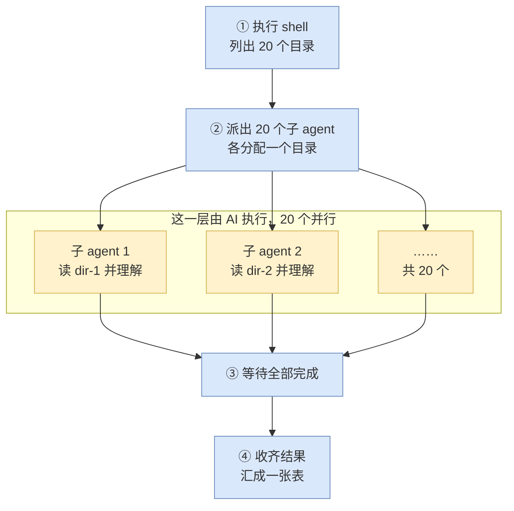
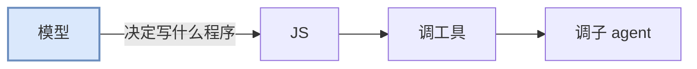
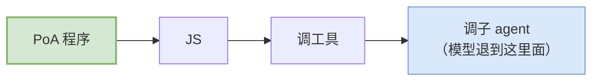

# 概览

PoA（Program of Agent）是 brainary 提供的一条通道：用普通 JavaScript 驱动一批 AI agent。将调度、分发、汇总、判定等固定性的业务逻辑，写在程序代码里。

---

## 1. 编排循环在谁那里

一个陌生仓库，根目录下有 20 个子目录，需要查明每个目录的用途、对外接口和依赖，最后汇成一张表。四种做法的区别不在是否使用 AI，而在编排循环由谁执行：

| 做法 | 编排由谁执行 | 结果 |
| --- | --- | --- |
| 脚本：grep + 统计 | 程序 | 能统计文件数与依赖，但回答不了"这个模块的用途是什么"，那需要读懂代码 |
| codex + 常规工具调用 | 模型 | 每读一个目录即一次采样，20 个目录需要二十余轮；每份原始输出都进入上下文；且每次运行选取的步骤可能不同 |
| codex + code mode，由模型写 JS | 模型 | 循环与统计收进了程序，采样降到一次；但这段 JS 由模型现场生成，编排逻辑仍不确定 |
| 自建编排框架（LangGraph、CrewAI 等） | 开发者 | 编排确定，但 agent 是自己拼的：工具面、沙箱、审批各自实现 |
| PoA | 开发者 | 编排是预先写定的代码，且直接跑在 codex 的工具面与沙箱上 |

前两行是两个极端：脚本有确定性但读不懂代码，模型读得懂但编排不确定。PoA 采用第三行的机制和第一行的确定性——一段普通的 JavaScript 派出 20 个子 agent，每个负责一个目录，再收回结果汇总。

后两行的差别见 §2。



蓝色四步是普通的程序代码，黄色一层才是 AI。分工如下：

- **判断交给 AI**："这个模块的用途是什么"只有读懂代码才能回答
- **调度、汇总、判定交给程序**：派多少个 agent、各自负责什么、结果如何合并，都是普通的 `for` / `if` / `Promise.all`

---

## 2. 控制方向，以及与自建编排框架的分工

模型走 code mode 时，模型是决策者，那段 JS 是模型的产物：



PoA 的方向相反：程序由开发者编写，模型只负责每个子 agent 内部的工作。



### 与 LangGraph 一类框架的关系

"编排写在程序里"这件事，LangGraph、CrewAI 这类框架本来就在做。PoA 与它们不构成同层替代：那些框架把编排放在调用方自己的进程里，模型、工具、沙箱都由调用方自行接入；PoA 把编排放进宿主的沙箱，换来的是与模型同一个沙箱、同一批工具、同一条分发路径的执行环境。

| | 自建编排框架 | PoA |
| --- | --- | --- |
| 编排代码跑在哪 | 调用方自己的进程 | 宿主的 V8 沙箱，一次提交跑完 |
| 子 agent 是什么 | 自己组装的模型调用 | codex 的会话实体，自带上下文、工具面与审批链路 |
| 工具从哪来 | 自己接，自己实现沙箱与权限 | 与模型同一批工具、同一条分发路径与记录（审批是例外，见 §3） |
| 断点续跑 / checkpointer | 有 | 无（《08-limits.md》§1） |
| 中途向人提问 / interrupt | 有 | 无（《08-limits.md》§3） |
| 中途取消一个失控的运行 | 有 | 无，只能杀进程（《08-limits.md》§2） |
| 流式消费、早停 | 有 | 无（《08-limits.md》§4） |
| 结构化输出校验 | 框架层提供 | 无内核校验，靠 prompt 加防御性解析（《08-limits.md》§5） |
| 运行时传参 | 有 | 无，参数写死或每次现拼包（《08-limits.md》§7） |
| 分发形态 | 自行定义 | `.poa` 包，可自带 MCP server |

---

## 3. 接入位置：codex 的 code mode

PoA 跑在 codex 的 code mode 上，不是另一套执行环境。

codex 向模型投送工具有两条路径：

| 路径 | 模型看到的 | 编排循环在哪 |
| --- | --- | --- |
| direct | 每个工具是请求体中的一项，带完整参数 schema | 模型的推理中。调 10 个工具即 10 次采样 |
| code mode | 只有一个名为 `exec` 的工具 | 一个 V8 程序中。模型只被采样一次 |

code mode 下，实际执行的工具被折叠进 `exec` 的说明文本：每个工具在那里各渲染出一段 TypeScript 声明，形状见《07-api-reference.md》§4。程序里按普通异步函数调用它们：

```js
const r = await tools.exec_command({ cmd: "ls -d */" });
```

模型发出一次 `exec`，参数是一段 JavaScript。这段 JS 在沙箱内循环、分支、并发地调用这些工具，只把整理后的结果交回模型；中间的 `ls` 原始输出不进入上下文。

> 上表的分界不是两种调用语法，而是循环由谁执行：direct 下每调用一次工具就要采样一次，循环位于模型的推理中；code mode 下循环位于 JS 中，模型只出手一次。
>
> 工具声明之所以落在 `exec` 的说明文本里，是因为模型可见的工具只剩 `exec`，其余工具没有别的位置可以声明。工具本身的参数与行为没有变化，改变的只是调用方。

### 提交入口

模型走这条路时，那段 JavaScript 由它自己生成。PoA 用的是同一条路上的另一个入口：模型以外的调用方也能提交这段 JS。

```
thread/codeMode/exec   { threadId, package }  →  { output }
```

`package` 是一个 base64 编码的 `.poa` 包，即一个 zip，根目录放 `manifest.toml`，内含程序本体与随包分发的文件。

这个接口只接受包，不接受裸源码。只持有一段 JS、没有任何需要随行的能力时，仍需先封装成一个不申报任何能力的最小包再提交。协议层没有第二个只接收源码的入口。

从这个入口进入之后，运行环境与模型同源：同一个沙箱、同一批工具、同一条分发路径与记录。主要的区别是这段代码由开发者预先写定，而非模型现场生成。

"同源"不等于处处等价，有两处不同，且都由"cell 不是一次模型回合"这同一个事实导出：模型可以续跑一个中途让出的 cell，程序侧没有对应手段；审批走到"等回执"这一步时，回执要登记在一次模型回合上，而 cell 从不建立回合，于是那次调用无限挂死，而不是像普通回合里那样被快速拒掉。两条分别见《08-limits.md》的 §1 与 §3。

接口接收包而非源码，是为了让程序能自带 MCP server：解包后启动这些 server，挂在 thread 级的扩展点上，任何前端只要能递入包就复用同一条路径。详见《10-packaging.md》文档。

当前各入口的支持情况：

| 入口 | 状态 |
| --- | --- |
| `codex exec --poa <目录或 .poa 文件>` | 可用。日常开发与分发都走这条 |
| `codex app-server` 的 `thread/codeMode/exec` | 可用，自研客户端走这条。`initialize` 时需声明 `capabilities.experimentalApi = true` |
| TUI 交互界面 | 暂不支持 |
| SDK（TypeScript / Python） | 暂不支持 |
| `codex mcp-server` | 暂不支持。该模式只暴露 `codex` / `codex-reply` 两个工具，都是采样回合，没有提交 cell 的入口 |

§2 中方向相反的箭头即来源于此：编排全程零模型调用，模型只出现在派出的子 agent 内部。

机制细节见《04-how-it-works.md》文档：`tools.foo()` 调用时发生了什么、哪些工具能进入 `tools.`、为什么并发不等于流式。

---

## 4. 三项收益

### 编排确定，且不消耗模型调用

"列出目录、每个目录派一个 agent、收齐后汇总"这段逻辑若交给模型推理，推理本身消耗 token，且每次运行得出的步骤可能不同。

写成程序之后，这部分零模型调用，每次行为一致。模型只出现在派出的子 agent 内部。

### 单个 agent 在结构上无法产生的结论

这一条的价值高于并行加速。典型例子是交叉验证：派三个互相看不见的 agent 分别反驳同一个结论，再由程序统计票数。

- 单个 agent 给出的置信度只是自我报告
- 三个互相看不见的 agent 分别尝试反驳之后该结论仍成立，才构成可信度
- "互相看不见"和"统计票数"只能由程序保证：一个 agent 无法假装自己没有读过某份材料

同类的还有信息路由，即由程序决定谁能看见什么。例如限定汇总者只能看到前一轮的产出、不允许读原文件，它的任何结论就必然来自那一轮派发，而不是自身的探索。

两者的写法见《06-patterns.md》文档。

### 一次昂贵的读取可以摊到多轮

子 agent 是有状态的长驻实体，不是无状态函数。它读一次大文件之后，后续多轮追问不必重读，文件已在它的上下文中。

---

## 5. 程序的典型形状

一个完整的 PoA 程序通常是以下形状：

首行那条 `// @exec:` 注释是这次运行的配置，必须在第 1 行：`yield_time_ms` 是本次运行的整体超时，`max_output_tokens` 是返回值的 token 预算，两者默认都只有 10000。

```js
// @exec: {"yield_time_ms": 900000, "max_output_tokens": 30000}

// ① 程序自行发现工作
const folders = await shellLines("ls -d */ | sed 's#/$##'", {
  validate: (line) => SAFE_NAME.test(line),
});

// ② 程序决定分发方式
const batch = await runBatch(
  folders.map((folder, i) => ({
    message: prompt(folder),
    name: `scan_${i}`,
    meta: { folder },           // ← 记录结果与输入的对应关系
  })),
  { concurrency: 3 },
);

// ③ 程序自行收口
text(JSON.stringify(batch.map(({ handle, reply }) => ({
  folder: handle.meta.folder,
  summary: parseJsonReply(reply).value,
}))));
```

`ls` 由程序执行，分发由程序决定，join 由程序编写。模型只负责每个 agent 内部的工作。

`shellLines` / `runBatch` / `parseJsonReply` 不是内置的，是一层普通 JS 封装，全文在《07-api-reference.md》§2.5，要抄进程序里才有。

逐行讲解见《05-writing.md》§0–§7。

---

## 6. 三个前提约束

以下三条在后续各篇中反复出现。

**①** PoA 程序运行在一个精简的 V8 沙箱中。没有 Node、没有文件系统 API、没有网络，也没有 `console.log`。但 `tools.exec_command` 提供了一个真实的 shell，因此"没有文件系统"仅指 JS 层面，读写文件仍然可以通过命令完成。

**②** 程序能传给子 agent 的只有一段任务文字。系统提示词无法修改。因此这段 `message` 是唯一的控制面，需要写得完整。

**③** 文本输出只有 `text()` 一条路径。中间过程全部留在沙箱内，只有主动写入返回值的内容才会返回。`image()` / `audio()` / `generatedImage()` 也会进入返回值（渲染成 `[input_image] …` 这样的一行摘要），但它们不是文本通道，供人阅读的正文仍然只能通过 `text()` 输出。
