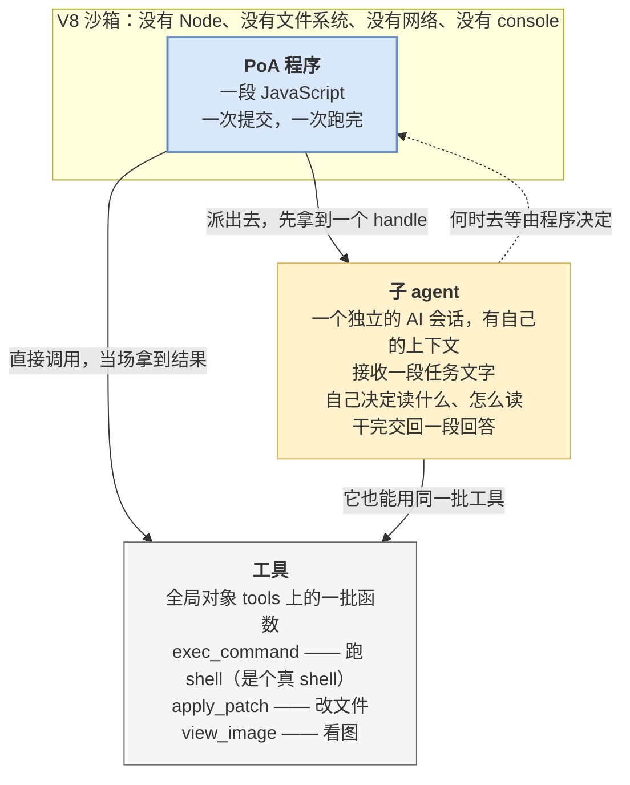
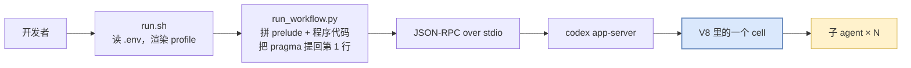

# 核心概念

[← 快速开始](./02-quickstart.md) · [返回目录](./index.md) · 下一篇：[工作原理](./04-how-it-works.md)

---

## 1. 三个角色

把这三个角色理清楚，后面就都好说了。



**PoA 程序**：一段 JS，一次提交、一次跑完。

**工具**：沙箱里有个全局对象 `tools`，上面挂着可调用的函数。`tools.exec_command` 提供一个真正的 shell。

**子 agent**：一个独立的 AI 会话，有自己的上下文和工具。它接收一段任务文字，自己决定读哪些文件、怎么读，最后交回一段回答。**它是异步的**——派出去先拿到一个 handle，何时去等由程序决定。

> 一句话概括：**程序是主角，工具是它的手，子 agent 是它雇的临时工。**

---

## 2. cell：一次提交，一次跑完

**cell** 是一次提交的那整段 JS 的一次运行。

这个概念之所以要单列，是因为它决定了几件反直觉的事：

| 事实 | 后果 |
| --- | --- |
| 一次提交 = 一个 cell = 一次跑完 | 没有"分阶段提交"，整个流程必须写在同一段代码里 |
| cell 结束时 V8 isolate 立即销毁 | **未 `await` 的 promise 被静默丢弃**，不报错 |
| cell 有整体超时（首行 pragma 的 `yield_time_ms`） | 整个并行派发必须在这个时间内跑完 |
| cell 中途没有办法交出部分结果再继续 | 长任务只能靠把超时调大硬扛，不能靠分段 |
| cell 跑起来之后无法从外部中止 | 跑飞了只能杀进程 |

后三条的完整说明见[边界与限制](./08-limits.md)。

---

## 3. 沙箱面：有什么、没什么

这一节最容易想错——沙箱比"一个 JS 环境"要**窄得多，同时又宽得多**。

### 被删掉的

`console`、`Atomics`、`SharedArrayBuffer`、`WebAssembly`。

### 完全没有的

没有 Node，没有文件系统 API，没有网络，没有 `require` / `import`，没有 `fetch`。

### 装进来的

| 全局 | 作用 |
| --- | --- |
| `tools` | 所有工具，`await tools.exec_command(...)` |
| `ALL_TOOLS` | `{name, description}` 数组——可以在 JS 里按名字筛工具 |
| `text(v)` / `image(v)` / `audio(v)` / `generatedImage(v)` | 往本次运行的返回值里追加一条内容项 |
| `store(k, v)` / `load(k)` | 会话级 KV，程序私有，模型看不见 |
| `notify(v)` | 不等程序结束，立刻额外送出一条内容。**PoA 下客户端收不到** |
| `yield_control()` | 先把已攒的输出交出去，程序继续跑。**PoA 下约等于提前结束** |
| `exit()` | 顶层提前 return |
| `setTimeout` / `clearTimeout` | **沙箱里全部的定时器能力就这两个** |

`Date.now()` 是有的——所以要时间戳不必额外开工具。同时也意味着**同一段程序重跑两次结果可能不同**。

各 primitive 的完整语义见 [API 参考 §1](./07-api-reference.md#1-全局-primitive12-个)。

> [!IMPORTANT]
> **JS 本身没有网络和文件系统，但 `tools.exec_command` 提供了一个真 shell。**
> 沙箱管的是 JS 引擎，**不是能力边界**——能力边界仍然是 codex 原本那套审批与沙箱策略。
> 别把"V8 沙箱"读成"这段代码干不了坏事"。

---

## 4. 一个必须先分清的界：prelude vs 内置

> [!IMPORTANT]
> **写下的那个文件不是被原样提交的。**

跑之前，runner 会把 `workflow-demos/lib/prelude.js`（174 行）**整个拼在程序代码前面**，然后把拼接结果作为一整段源码提交。

所以下面这两类名字，来源完全不同：

| 类别 | 有哪些 | 来源 | 改得动吗 |
| --- | --- | --- | --- |
| **prelude 提供的** | `AGENT_BACKEND`、`requireAgents`、`mapLimit`、`spawnAgent`、`spawnMany`、`collectAll`、`runBatch`、`sendAndWait`、`closeAll`、`parseJsonReply`、`shellLines`、`SAFE_NAME` | 仓库自己写的一层薄封装 | ✅ 就在 `workflow-demos/lib/prelude.js`，174 行，不是黑盒 |
| **codex 内置的** | `tools`、`ALL_TOOLS`、`text`、`notify`、`exit`、`store`、`load`、`setTimeout` 等 12 个全局 primitive | codex 本体 | ❌ 只能查，改不了 |

**为什么这个区分重要**：

- 换一个客户端、不拼 prelude 的话，**前一类全都不存在**
- prelude 那些函数的行为可以直接读源码确认；内置那些只能查文档
- 出问题时，知道该去哪一侧排查

### prelude 为什么存在

一句话：**codex 的多 agent 工具有两代，形状完全不同，而且各有毛病。**

| 问题 | v1 后端 | v2 后端 |
| --- | --- | --- |
| `wait_agent` 返回什么 | 直接返回最终答复 | **只是一个"有动静了"的信号**，不带内容 |
| 收 N 个结果怎么写 | 一次等多个只会反复返回最先完成的那个，所以得**一个一个等** | 状态和答复要另外去 `list_agents` 里捞，所以是个**轮询循环** |
| agent 用什么标识 | spawn 返回的 `agent_id` | 调用方给的 `task_name`，**且返回的是全限定路径** |
| 有没有"关闭"操作 | 有，且**已完成的 agent 不关掉仍占并发名额** | 没有 |

prelude 把这些差异全部盖住了，所以**同一段程序在两代后端上写法完全一样**。代价是这一层里带后端分支的代码占了将近一半。

---

## 5. handle 与 `meta`

派出一个子 agent，拿到的是一个 handle：

```js
{ key, label, meta }
```

| 字段 | 是什么 |
| --- | --- |
| `key` | 后端认的标识，后续等待 / 追问 / 关闭都靠它 |
| `label` | 面向人的名字（v1 下是自动起的昵称） |
| `meta` | **留给调用方塞上下文的口袋。** prelude 不解释它，只负责原样带回来 |

> [!WARNING]
> **`meta` 不是可选的锦上添花。**
> agent 的回答文本里**不包含"我是谁"**，程序必须自己记。收口时靠 `handle.meta.folder` 这类字段
> 把结果对回输入，不然收到的只是一堆匿名回复。

---

## 6. 两代后端与 profile

### 后端不由本地配置决定

用 v1 还是 v2 后端，**由模型元数据决定**，写在 codex 的模型清单里。没有任何 feature 开关能强制回到 v1。

唯一的杠杆是**替换整个模型清单**——`v1-forced` 这个 profile 干的就是这件事：它现场派生一份把所有模型钉到 v1 的清单。

**推论**：同一个模型换个 profile，code mode 里能看到的 agent 工具数会从 0 变到 5 或 6。所以：

> **第一条命令永远是探针。** 换模型、换 provider、换 profile 之后都要重跑。

### 三个 profile

| profile | 后端 | 说明 |
| --- | --- | --- |
| `v1` | 取决于模型 | **陷阱。** 多数模型自报 v2，而 v2 工具默认进不了 code mode → 0 个 agent 工具 |
| `v1-forced` | v1 | **推荐默认。** 把所有模型钉到 v1 |
| `v2` | v2 | 需要更新的模型；额外显式打开了 v2 工具进 code mode 的开关 |

`./run.sh` 不给 profile 时的默认值恰好是那个坏的 `v1`。**永远显式写。**

### 两代的差异对写程序的影响

大部分差异被 prelude 盖住了，但有三件事漏出来，写程序时必须知道：

| 差异 | v1 | v2 |
| --- | --- | --- |
| **并发名额** | 默认 **6**，不减 root | 上限**减 1**（root 线程占一个）。默认上限 4 → **实际只剩 3** |
| **递归深度刹车** | 有，且拦两道——子 agent 天然派不出孙 agent | **没有**，无条件放行。刹车只能在 JS 里自己踩 |
| **`closeAll` 有没有用** | 有效，且**必须调**（已完成的 agent 仍占名额） | 空操作，因为 v2 那组工具里根本没有"关闭" |

第二条是实打实的风险，详见[编写指南 §6.4](./05-writing.md#64-递归深度v2-下没有刹车)。

---

## 7. 提交链路：代码是怎么进去的

知道这条链有助于判断报错落在哪一侧。



三件值得记住的事：

**① 改 demo 或 prelude 不需要重建二进制**——它们是运行时被读成字符串送进去的。

**② pragma 会被自动提到第 1 行。** prelude 有 174 行，直接拼在前面会把 `// @exec:` 挤到第 175 行，那就**不生效了，而且不报错**。runner 专门做了这一步提取。但换成自研客户端拼源码时，**没有任何环节会代劳**。

**③ 报错落在哪一侧决定去哪查**：宿主机侧的失败在 Python traceback 或 shell 里；V8 侧的失败在 RPC 返回的内容里。

---

## 8. 全程无人值守

这不是一个选项，是这条通道的性质：

- 客户端对服务端的**反向请求一律自动批准**，配合 profile 里的"从不询问"审批策略，整条链路上**不存在任何人工审批点**
- 程序**没有跟人对话的手段**——那个能问用户问题的工具只给模型，程序调不到

**推论**：任何一次阻塞询问都会把整条链路挂死，所以 PoA 程序必须能在没有人的情况下从头跑到尾。需要人判断的地方，只能把判断也写成代码（比如数票），或者把问题留到最后输出里。

---

[← 快速开始](./02-quickstart.md) · [返回目录](./index.md) · 下一篇：[工作原理](./04-how-it-works.md)
