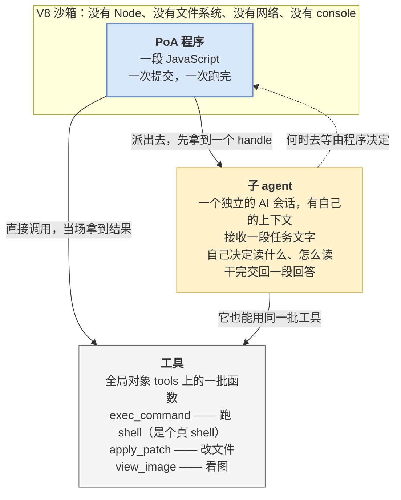
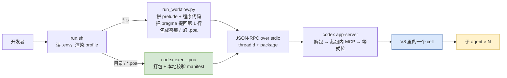

# 核心概念

[← 快速开始](./02-quickstart.md) · [返回目录](./index.md) · 下一篇：[工作原理](./04-how-it-works.md)

---

## 1. 三个角色

把这三个角色理清楚，后面就都好说了。



**PoA 程序**：一段 JS，一次提交、一次跑完。

**工具**：沙箱里有个全局对象 `tools`，上面挂着可调用的函数。`tools.exec_command` 提供一个真正的 shell。

**子 agent**：一个独立的 AI 会话，有自己的上下文和工具。它接收一段任务文字，自己决定读哪些文件、怎么读，最后交回一段回答。**它是异步的**——派出去先拿到一个 handle，何时去等由程序决定。

> 一句话概括：**程序是主角，工具是它的手，子 agent 是它雇的临时工。**

---

## 2. cell：一次提交，一次跑完

**cell** 是一次提交的那整段 JS 的一次运行。

这个概念之所以要单列，是因为它决定了几件反直觉的事：

| 事实 | 后果 |
| --- | --- |
| 一次提交 = 一个 cell = 一次跑完 | 没有"分阶段提交"，整个流程必须写在同一段代码里 |
| cell 结束时 V8 isolate 立即销毁 | **未 `await` 的 promise 被静默丢弃**，不报错 |
| cell 有整体超时（首行 pragma 的 `yield_time_ms`） | 整个并行派发必须在这个时间内跑完 |
| cell 中途没有办法交出部分结果再继续 | 长任务只能靠把超时调大硬扛，不能靠分段 |
| cell 跑起来之后无法从外部中止 | 跑飞了只能杀进程 |

后三条的完整说明见[边界与限制](./08-limits.md)。

---

## 3. 沙箱面：有什么、没什么

这一节最容易想错——沙箱比"一个 JS 环境"要**窄得多，同时又宽得多**。

### 被删掉的

`console`、`Atomics`、`SharedArrayBuffer`、`WebAssembly`。

### 完全没有的

没有 Node，没有文件系统 API，没有网络，没有 `require` / `import`，没有 `fetch`。

### 装进来的

| 全局 | 作用 |
| --- | --- |
| `tools` | 所有工具，`await tools.exec_command(...)` |
| `ALL_TOOLS` | `{name, description}` 数组——可以在 JS 里按名字筛工具 |
| `text(v)` / `image(v)` / `audio(v)` / `generatedImage(v)` | 往本次运行的返回值里追加一条内容项 |
| `store(k, v)` / `load(k)` | 会话级 KV，程序私有，模型看不见 |
| `notify(v)` | 不等程序结束，立刻额外送出一条内容。**PoA 下客户端收不到** |
| `yield_control()` | 先把已攒的输出交出去，程序继续跑。**PoA 下约等于提前结束** |
| `exit()` | 顶层提前 return |
| `setTimeout` / `clearTimeout` | **沙箱里全部的定时器能力就这两个** |

`Date.now()` 是有的——所以要时间戳不必额外开工具。同时也意味着**同一段程序重跑两次结果可能不同**。

各 primitive 的完整语义见 [API 参考 §1](./07-api-reference.md#1-全局-primitive12-个)。

> [!IMPORTANT]
> **JS 本身没有网络和文件系统，但 `tools.exec_command` 提供了一个真 shell。**
> 沙箱管的是 JS 引擎，**不是能力边界**——能力边界仍然是 codex 原本那套审批与沙箱策略。
> 别把"V8 沙箱"读成"这段代码干不了坏事"。

---

## 4. 一个必须先分清的界：prelude vs 内置

> [!IMPORTANT]
> **写 demo 时，写下的那个文件不是被原样提交的。**

跑 `demos/*.js` 时，runner 会把 `workflow-demos/lib/prelude.js`（243 行）**整个拼在程序代码前面**，然后把拼接结果当作 `entry` 提交。

所以下面这两类名字，来源完全不同：

| 类别 | 有哪些 | 来源 | 改得动吗 |
| --- | --- | --- | --- |
| **prelude 提供的** | `AGENT_BACKEND`、`requireAgents`、`mapLimit`、`spawnAgent`、`spawnMany`、`collectAll`、`runBatch`、`sendAndWait`、`closeAll`、`parseJsonReply`、`shellLines`、`SAFE_NAME`、`hasTool`、`callTool`、`shapeOf`、`timed` | 仓库自己写的一层薄封装 | ✅ 就在 `workflow-demos/lib/prelude.js`，243 行，不是黑盒 |
| **codex 内置的** | `tools`、`ALL_TOOLS`、`text`、`notify`、`exit`、`store`、`load`、`setTimeout` 等 12 个全局 primitive | codex 本体 | ❌ 只能查，改不了 |

**为什么这个区分重要**：

- 换一个客户端、不拼 prelude 的话，**前一类全都不存在**
- prelude 那些函数的行为可以直接读源码确认；内置那些只能查文档
- 出问题时，知道该去哪一侧排查

> [!CAUTION]
> **写成 `.poa` 包时，prelude 不会被拼进去。** 包的 `entry` 是原样提交的——这是格式的定义，不是配置。
> 于是上表第一行那 16 个名字**全部不存在**，`runBatch is not defined` 是包作者最常见的第一个报错。
> 要用就把 `prelude.js` 抄进包里——**抄在首行 pragma 之后，第 1 行永远留给 `// @exec:`**，否则会踩[另一个坑](./05-writing.md#1-首行-pragma)。或者干脆只用内置那一档。详见 [§9](#9-poa-包自带能力的那条路)。

### prelude 为什么存在

一句话：**codex 的多 agent 工具有两代，形状完全不同，而且各有毛病。**

| 问题 | v1 后端 | v2 后端 |
| --- | --- | --- |
| `wait_agent` 返回什么 | 直接返回最终答复 | **只是一个"有动静了"的信号**，不带内容 |
| 收 N 个结果怎么写 | 一次等多个只会反复返回最先完成的那个，所以得**一个一个等** | 状态和答复要另外去 `list_agents` 里捞，所以是个**轮询循环** |
| agent 用什么标识 | spawn 返回的 `agent_id` | 调用方给的 `task_name`，**且返回的是全限定路径** |
| 有没有"关闭"操作 | 有，且**已完成的 agent 不关掉仍占并发名额** | 没有 |

prelude 把这些差异全部盖住了，所以**同一段程序在两代后端上写法完全一样**。代价是这一层里带后端分支的代码占了将近一半。

---

## 5. handle 与 `meta`

派出一个子 agent，拿到的是一个 handle：

```js
{ key, label, meta }
```

| 字段 | 是什么 |
| --- | --- |
| `key` | 后端认的标识，后续等待 / 追问 / 关闭都靠它 |
| `label` | 面向人的名字（v1 下是自动起的昵称） |
| `meta` | **留给调用方塞上下文的口袋。** prelude 不解释它，只负责原样带回来 |

> [!WARNING]
> **`meta` 不是可选的锦上添花。**
> agent 的回答文本里**不包含"我是谁"**，程序必须自己记。收口时靠 `handle.meta.folder` 这类字段
> 把结果对回输入，不然收到的只是一堆匿名回复。

---

## 6. 两代后端与 profile

### 后端不由本地配置决定

用 v1 还是 v2 后端，**由模型元数据决定**，写在 codex 的模型清单里。没有任何 feature 开关能强制回到 v1。

唯一的杠杆是**替换整个模型清单**——`v1-forced` 这个 profile 干的就是这件事：它现场派生一份把所有模型钉到 v1 的清单。

**推论**：同一个模型换个 profile，code mode 里能看到的 agent 工具数会从 0 变到 5 或 6。所以：

> **第一条命令永远是探针。** 换模型、换 provider、换 profile 之后都要重跑。

### 四个 profile

| profile | 后端 | agent 工具 | 工具总数 | 说明 |
| --- | --- | --- | --- | --- |
| `v1` | 取决于模型 | 0 | 8 | **陷阱。** 多数模型自报 v2，而 v2 工具默认进不了 code mode |
| `v1-forced` | v1 | 5 | 13 | **推荐默认。** 把所有模型钉到 v1 |
| `v2` | v2 | 6 | 14 | 需要更新的模型；额外显式打开了 v2 工具进 code mode 的开关 |
| `full` | v1（钉法同 `v1-forced`） | 5 | 20 | **差在工具面，不在后端。** 把可选工具组全打开 |

`./run.sh` 不给 profile 时的默认值恰好是那个坏的 `v1`。**永远显式写。**

> [!IMPORTANT]
> **第一行取决于模型，不取决于 profile。** 自带清单里只有 `gpt-5.6-sol` 和 `gpt-5.6-terra` 标了 `multi_agent_version: v2`，`gpt-5.6-luna` 本来就是 v1——所以用 luna 时 `v1` 这个 profile 会正常解析到 v1 并给出 5 个 agent 工具，`v1-forced` 对它是空操作。
>
> 上面那张表是"某个模型 + 某份清单"的一张快照。**你那套是什么样，只有探针答得了。**

`full` 打开的是这几组（各自的门不止一道）：

| 工具 | 需要什么 |
| --- | --- |
| `clock__curr_time` | `[features.current_time_reminder] enabled` |
| `get_context_remaining` | `[features] token_budget` |
| `request_permissions` | `[features] request_permissions_tool`，且得存在一个 environment |
| `memories__*`（4 个） | `[features] memories` **且** `[memories] dedicated_tools`——**两个都要，少一个是零个工具而不是一半** |

写操作还额外要一个可写沙箱，那个走环境变量不在 profile 里：

```bash
CODEX_DEMO_SANDBOX=workspace-write ./run.sh demos/08_file_and_image.js full
```

### 两代的差异对写程序的影响

大部分差异被 prelude 盖住了，但有三件事漏出来，写程序时必须知道：

| 差异 | v1 | v2 |
| --- | --- | --- |
| **并发名额** | 默认 **6**，不减 root | 上限**减 1**（root 线程占一个）。默认上限 4 → **实际只剩 3** |
| **递归深度刹车** | 有，且拦两道——子 agent 天然派不出孙 agent | **没有**，无条件放行。刹车只能在 JS 里自己踩 |
| **`closeAll` 有没有用** | 有效，且**必须调**（已完成的 agent 仍占名额） | 空操作，因为 v2 那组工具里根本没有"关闭" |

第二条是实打实的风险，详见[编写指南 §6.4](./05-writing.md#64-递归深度v2-下没有刹车)。

---

## 7. 提交链路：代码是怎么进去的

知道这条链有助于判断报错落在哪一侧。**现在有两条**，`run.sh` 按目标形态自动分流：给它一个目录或 `.poa` 文件走下面那条，给它一个 `.js` 走上面那条。



四件值得记住的事：

**① 改 demo 或 prelude 不需要重建二进制**——它们是运行时被读成字符串送进去的。包也一样：`codex exec --poa <目录>` 每次现打包，没有"先 build 再跑"这一步。

**② 协议层只有一种形状。** 不管走哪条路，最后发出去的都是 `{ threadId, package }`。只持有一段 JS 的客户端（如 `run_workflow.py`）会现场封装一个申报零能力的包，**接口没有另一个只收源码的入口**。

**③ pragma 会被自动提到第 1 行——只在上面那条路上。** prelude 有 243 行，直接拼在前面会把 `// @exec:` 挤到第 244 行，那就**不生效了，而且不报错**。runner 专门做了这一步提取。走包这条路时 `entry` 原样提交，pragma 天然在第 1 行；但换成自研客户端拼源码时，**没有任何环节会代劳**。

**④ 报错落在哪一侧决定去哪查**：宿主机侧的失败在 Python traceback 或 shell 里（走包这条路时不经 `run_workflow.py`，坏包是 `codex` 自己报的，直接 `exit(2)`——但 `run.sh` 仍会用 python3 生成模型清单和解析 `CODEX_BIN`）；V8 侧的失败在 RPC 返回的内容里。

---

## 8. 全程无人值守

**当前这条通道上没有任何人工介入点**，有两个并列的原因：

- 服务端发回来的请求由客户端**代答，不经过人**。`runner/rpc_client.py` 分两种答法：codex 借 elicitation 发来的**工具审批**（`_meta` 里带 `codex_approval_kind`）一律 `accept`——理由是能力已经在 manifest 里申报过，这里放行是照申报办事，不是无差别点头；而**真正来自 MCP server 的提问**一律 `decline`，因为这条链路上没有人能答。配合 profile 里的"从不询问"审批策略，整条链路上**不存在任何人工介入点**
- 程序**没有跟人对话的手段**——那个能问用户问题的内置工具只给模型，程序调不到，[三道门](./08-limits.md#3-无人值守)每一道单独就够挡死

**推论**：任何一次阻塞询问都会把整条链路挂死，所以 PoA 程序必须能在没有人的情况下从头跑到尾。需要人判断的地方，只能把判断也写成代码（比如数票），或者把问题留到最后输出里。

> [!NOTE]
> **这是实现的现状，不是设计上的取舍。** **issue #21** 正在推进"让程序能问人"，尚未落地。
> 但**包这条路是个例外**——`codex exec` 在 `ConfigOverrides` 里把审批策略设成 `never`（压在 `-c` 之上，覆盖不掉），问人的请求一律毫秒级自动 decline，所以**打成包分发的程序，即使那条落地了也问不到人**。

---

## 9. PoA 包：自带能力的那条路

> **程序可以像一个安装包那样，把自己要用的 MCP server 带在身上。** 能力申报写在包的 `manifest.toml` 里，服务端解包后按 thread 把它们起起来——不需要事先在宿主的 `config.toml` 里配好。能自带到什么程度，见[边界与限制 §6](./08-limits.md#6-自带能力只到-stdio-mcp)。

### 一个包长什么样

```
poas/00_echo/
├── manifest.toml       [poa] 元数据 + [[capabilities.mcp]] 能力申报
├── main.js             程序本体，原样提交（不拼 prelude）
└── mcp/echo.mjs        随包分发的 stdio MCP server，零依赖
```

`.poa` 就是这个目录打成的 zip，**`manifest.toml` 必须在根上**。

```toml
[poa]
name = "echo_expert"
version = "0.1.0"
runtime = "codex-v8"      # 只认这一个值，别的直接反序列化失败
poa_api_version = 1       # 只认 1
entry = "main.js"         # 必须 .js/.mjs，必须在包内
description = "..."       # 可选

[[capabilities.mcp]]
name = "echo"                     # 只能用字母数字和 _ -，且不能重名
type = "stdio"                    # 只有这一种；写 network 会在解析阶段报错
shell = "node mcp/echo.mjs"       # 按 shell 语法切成 argv，直接派生，不经 sh -c
description = "..."               # 可选
```

**这就是全部字段了**，两件事值得单独说：

- **没有 `env`。** 想给 server 传 API key 之类的东西，当前没有口子——一个"需要凭据的 server"暂时打不进包里。
- **未知字段被静默忽略，不报错。** manifest 没开严格模式（是有意的，为了让"给更新版运行时写的 manifest"栽在 `runtime` 上而不是栽在字段名上）。**代价是字段名打错等于没写**：`entery = "main.js"` 会安静地按"缺 entry"处理。别把 `poa_api_version` 对不上就直接拒这件事，推广成"整个 manifest 都是严校验"。

### 跑起来的时候发生了什么

**两条路解包的地方不一样**，排障时要分清：

```
① codex exec --poa <目录|.poa>          ② 自研客户端（如 run_workflow.py）
   ├─ 目录现打包 / .poa 直接读              ├─ 自己造包（现成 JS 就包成零能力包）
   ├─ 校验 manifest + 解包到临时目录        └─ base64 → JSON-RPC
   │    ← 坏包在这里就是 exit(2)，                  { threadId, package }
   │      一个会话都不会起                              ↓
   └─ 进程内直接把 PoaPackage 传给                codex app-server
      app-server（同进程，不过 JSON）             ├─ 解 base64、校验、解包
                    ↓                            └──────────┬─────────
              （两路在此汇合）                               │
                    ↓                                       │
       ├─ 每条 [[capabilities.mcp]] 注册成 thread 级 MCP server（cwd = 包根）
       ├─ 等这些 server 全部就位，再捕获工具面   ← 顺序是关键，见下
       ├─ 任何一个没在工具面上留下工具 → 拒跑
       └─ 把 entry 的内容当源码送进 V8
```

四件必须知道的事：

**① "组装在服务端"指的是起 server，不是解包。** `codex exec --poa` 走的是**进程内**调用，包在客户端就打好、校验完、解压好了，`PoaPackage` 作为一个 Rust 值直接传进去，**全程没有 base64、没有 JSON 序列化**。base64 只发生在真正跨进程的 stdio JSON-RPC 上。

真正在服务端的是**起 MCP server** 这一段——它挂在 thread 级的扩展点上，所以任何前端只要能把包递进去就能复用。

> [!NOTE]
> **设计上如此，目前只有 CLI 实现了。** `codex exec --poa` 是当前**唯一**的包入口——TUI 和 SDK 里一行 PoA 相关代码都没有。"TUI/SDK 也能跑包"是这套设计想达成的目标，不是现状。

**② server 随 thread 生死，不写全局配置。** 包起的 server 只对这一个 thread 可见，`config.toml` 一个字都不改，thread 关掉进程就回收。

**③ 顺序不能反。** 包必须在"捕获工具面"之前发布，因为捕获工具面这一步才是建工具计划的时候。晚一步注册的 server，对这个 cell 来说等于不存在。

**④ 起不来就拒跑。** 判据是"这个 server 有没有在工具面上留下工具"，所以起来了但一个工具都不报的 server**同样算缺席**。这是刻意与采样循环相反：模型少个工具可以换条路走，程序不行。启动超时 30 秒。

### 两个一定会踩的坑

**① 工具名不能硬编码。** `mcp__echo__echo` 是当前配置下的产物——前缀取决于 `prefix_mcp_tool_names()`，命名空间会被清洗、重名时还会加哈希后缀。正确写法是从 `ALL_TOOLS` 里按后缀找并断言唯一，完整写法与理由见 [API 参考 §3.1](./07-api-reference.md#31-速查表)。

**② 工具必须标注，否则会被审批拦下。** 默认 `auto` 审批模式下，codex 对一个没有标注的 MCP 工具的假设是"它可能写、可能联网"，于是发起一次 elicitation——而这条链路上[没有人](#8-全程无人值守)。

标注写在 MCP server `tools/list` 返回里每个工具的 `annotations` 上：

```js
annotations: { readOnlyHint: true, destructiveHint: false, openWorldHint: false }
```

> [!IMPORTANT]
> **三个都要写，只写 `readOnlyHint` 不保险。** 判定顺序是 `destructiveHint === true` **先短路**（直接要审批），才轮到看 `readOnlyHint`。所以 `{readOnlyHint: true, destructiveHint: true}` 这种自相矛盾的组合仍然会被拦。
>
> **整个 server 照抄 `workflow-demos/poas/00_echo/mcp/echo.mjs`** —— 零依赖、手写 stdio JSON-RPC、注释里就写着每个标注为什么要在，是个可以直接拿走的模板。

标注的顺带好处：只读同时也是[并行安全的判据](./04-how-it-works.md#哪些工具是并行安全的)，所以包自带的只读 server **是可以真并行的**（`ext/poa` 建的 config 里 `supports_parallel_tool_calls` 硬编码为 `false`，服务器级的整体豁免用不了，**只能逐个工具标只读**）。

> [!CAUTION]
> **不标注的后果按 `approval_policy` 分叉，其中一支是不可恢复的挂死。**
>
> | 审批策略 | 后果 |
> | --- | --- |
> | `never`（**四个 profile 都是这个**） | 毫秒级自动 decline，客户端全程收不到请求。工具调用失败，**看起来像"人拒绝了"，其实人根本没被问** |
> | 默认（`auto` / `on-request`） | **无限挂死。** 客户端收得到请求、也答了，但**答案被 core 丢弃**——审批回执登记在 `active_turn` 上，而 cell 从不建 `active_turn`。`yield_time_ms` 也不生效，钉死的是整条 `thread/codeMode/exec` RPC，客户端跟着一起卡 |
>
> 后一支就是 **issue #32**，已有实测（同一个不带 `readOnlyHint` 的工具，放进普通 turn 或子 agent 里 0.6 秒走通，放进 code mode 必挂）。**没有任何一层超时兜得住**——MCP 侧那 300 秒的默认超时在挂点的下游，压根没轮到它。
>
> 所以标注这件事对包作者不是"避免弹窗"，是**避免一个查不出来的死锁**。

### 边界

| 能 | 不能 |
| --- | --- |
| `stdio` MCP server | `network` 传输（解析阶段拒，不是静默忽略） |
| 任意随包文件 | `[build]` 段、resources |
| 根线程的工具面 | **子 agent 的工具面**——它跑在自己的 thread 上，拿不到包里的 server |

还有几个数字：**包上限 64 MiB**（因为要 base64 塞进一条 JSON-RPC 消息），解压后 256 MiB / 100 倍膨胀比 / 4096 个条目三道闸，**解出来的文件权限固定 `0644`**（所以 server 要写成 `node mcp/xxx.mjs` 这种带解释器的命令行，别指望可执行位）。

### 分发：`poas/build.sh`

以下都在 `workflow-demos/` 下执行：

```bash
./run.sh        poas/00_echo v1-forced   # 目录直接跑，不用先 build
poas/build.sh   poas/00_echo             # → ./00_echo.poa（脚本在 poas/ 下，不在根上）
./run.sh        ./00_echo.poa v1-forced  # 打好的包也照跑
```

**`build.sh` 只为"给别人一个文件"而存在**——`codex exec --poa <目录>` 本来就现打包。它写文件前先校验，时间戳钉在 zip 纪元所以**打两次字节一样**。

> [!WARNING]
> **两条打包路径选的文件不一样，别以为等价。**
>
> | | `poas/build.sh` | codex 自己打包（`--poa <目录>`） |
> | --- | --- | --- |
> | 选文件 | 走 `git ls-files`，**`.gitignore` 掉的不进包**（会在 stderr 报一行） | 显式关掉全部 ignore 规则，**目录里有什么就打什么** |
> | 权限位 | 保留原始权限 | 一律 `0644` |
>
> 权限那行不影响结果——**解包时无条件覆盖成 `0644`**，两边最终一样。但选文件那行会咬人：包目录里有被 gitignore 的文件时，**你本地 `--poa <目录>` 跑通的包，`build.sh` 打出来发给别人可能就少文件**。发包前用 `poas/build.sh` 打一份、再 `./run.sh ./x.poa` 跑一遍，是唯一可靠的验证。

> [!NOTE]
> **包不需要 provider 也能跑。** 包本体不采样，所以 `run.sh` 对包目标会兜底一套占位的 key / model / base_url，而且 base_url 故意用一个**关闭的端口**（`127.0.0.1:9`）——万一程序真的去采样了，应当当场炸掉，而不是连上碰巧在监听的某台主机。这套兜底排在 `.env` 和 `CODEX_DEMO_*` **下面**，配了真 provider 照常生效。

代码位置：格式与校验在 `codex-rs/poa/`，起 server 在 `codex-rs/ext/poa/`。

---

[← 快速开始](./02-quickstart.md) · [返回目录](./index.md) · 下一篇：[工作原理](./04-how-it-works.md)
