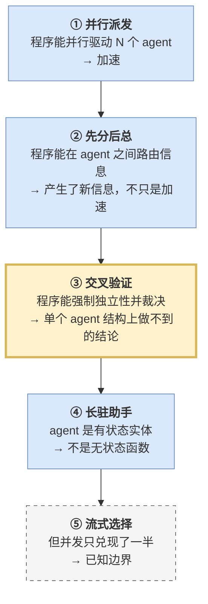

# 模式库

[← 编写指南](./05-writing.md) · [返回目录](./index.md) · 下一篇：[API 参考](./07-api-reference.md)

这四种形状覆盖了绝大多数 PoA 程序。它们是一条**递进链**，不是四个平行样例：



**③ 是这套东西的最高点，⑤ 是它诚实的注脚。**

每种模式在 `workflow-demos/demos/` 下都有一个可运行的实现，跑法见[快速开始 §2](./02-quickstart.md#2-第二步跑一个现成的程序)。

---

## 模式 ① 并行派发（fan-out / fan-in）

**用于**：N 个互不相干的活，一次派出去，一次收齐。

**参考实现**：`demos/01_fanout_summary.js`

```js
const items = (await shellLines("ls -d */ | sed 's#/$##'", {
  validate: (line) => SAFE_NAME.test(line),
})).slice(0, MAX_ITEMS);

const batch = await runBatch(
  items.map((x, i) => ({ message: prompt(x), name: `scan_${i}`, meta: { x } })),
  { concurrency: CONCURRENCY },
);

const results = batch.map(({ handle, reply }) => ({
  item: handle.meta.x,
  ...parseJsonReply(reply),
}));
```

**要点**：

- `meta` 把结果映射回输入——agent 的回答里不含"我是谁"
- `concurrency` 按可用名额估（v1 从 6 起算，v2 从 3 起算，再减 1）
- 收口必须防御性解析

**衡量它有没有成功**：看 `succeeded / total`。注意这个比值**量的不是 agent 答得好不好，而是「靠 prompt 逼 JSON」这个办法有多不靠谱**——分母是派出去的数量，分子是成功解析出 JSON 的数量。

---

## 模式 ② 先分后总（map-reduce）

**用于**：需要跨来源比对的问题——单个 worker 只看得见自己那份，答不出来。

**参考实现**：`demos/02_map_reduce.js`

在模式 ① 上加第二阶段：N 个 worker 各读一个目录，**再派一个汇总者，只喂给它前面那批产出**。

```js
const facts = (await runBatch(mapSpecs, { concurrency: 4 }))
  .map((b) => parseJsonReply(b.reply).value)
  .filter(Boolean);

const [{ reply }] = await runBatch([{
  message: [
    `你是汇总者。下面是几份报告。`,
    `不要读任何文件，只根据这些数据推理。`,        // ← 关键
    JSON.stringify(facts, null, 2),
    `回答：哪些依赖在 2 份以上报告里都出现？`,      // ← 单个 worker 答不出的问题
    `只回一行 JSON：{"shared_dependencies":[...],"observation":"<一句话>"}`,
  ].join("\n"),
}]);
```

> [!IMPORTANT]
> **「不要读任何文件」这一句是整个模式的支点。**
> 它把汇总者的信息来源掐断到只剩程序喂进去的那份 JSON，**于是它的任何结论都必然来自前一轮派发**。
>
> **程序在这里扮演的是信息路由器——决定谁看得见什么。**
> 这是单个 agent 结构上做不到的事：一个 agent 没法假装自己没读过某个文件。

**衡量它有没有成功**：看那个需要跨报告比对才能填的字段（例子里是 `shared_dependencies`）。它非空，就是"派发确实产生了新信息，而不只是加速"的证据。

---

## 模式 ③ 交叉验证（对抗评审）

**用于**：真正要的不是一个答案，而是**这个答案的可信度**。

**参考实现**：`demos/03_adversarial_review.js`

三阶段：一个 agent 提出可检验的断言 → 三个 agent 各带一个视角去**反驳** → **程序数票**。

```js
const REVIEWERS = [
  { lens: "存在性", ask: "断言里提到的文件和符号真的存在吗？去查。" },
  { lens: "语义",   ask: "就算存在，代码行为真的和断言说的一致吗？" },
  { lens: "分寸",   ask: "断言是不是说过头了——只在很窄的情况下成立？" },
];

const verdicts = await runBatch(
  REVIEWERS.map((r, i) => ({
    message: [
      `断言：${claim}`,
      r.ask,
      `证据不清楚时默认判定为被反驳。`,               // ← 默认有罪
      `只回一行 JSON：{"refuted":true|false,"why":"<一句话>"}`,
    ].join("\n"),
    name: `review_${i}`,
    meta: r,
  })),
  { concurrency: 3 },
);

const usable = verdicts
  .map((v) => ({ ...v, verdict: parseJsonReply(v.reply).value }))
  .filter((v) => v.verdict);

const refutedCount = usable.filter((p) => p.verdict.refuted === true).length;
const survives = usable.length > 0 && refutedCount < Math.ceil(usable.length / 2);
// 多数反驳即判死；平票也算反驳
```

### 三个设计要点，缺一条就不成立

**① 视角是分化的，不是冗余的。** 三种不同的出错方式：符号不存在 / 存在但行为不符 / 行为对但说过头了。**冗余检查抓不到多样化的错误。**

**② 默认有罪。** prompt 里写死"证据不清楚时默认判定为被反驳"。**模型天然倾向附和**——不把默认值扳过去，三个 reviewer 会一致点头。

**③ 判决在程序里，不在模型里。** 就是最后那两行代码。

> [!TIP]
> **这是 PoA 核心论点的实证。**
> 一个 agent 说"我很确信"是**自我报告**；三个互相看不见的 agent 分别尝试反驳后它仍站得住，
> 才是**可信度**。而"互相看不见"和"数票"**只能由程序保证**。

**衡量它有没有成功**：看 `survives_review`。它是这几种模式里**唯一一个单个 agent 结构上无法产生的输出**。

---

## 模式 ④ 长驻助手（有状态多轮）

**用于**：一次昂贵的读取要摊到多次提问上。

**参考实现**：`demos/04_stateful_dialogue.js`

前三种模式里 agent 都是一次性函数调用，这一种把它当作**能持续对话的实体**：读一次文件，然后跨多轮追问，**且不许重读**。

```js
const [h] = await spawnMany([{
  message: `读一遍 ${target}，报告行数和主题。读完记住内容——之后不许再读，凭记忆回答。`,
}]);

const a1 = await sendAndWait(h, "不要重读。凭记忆列出你看到的 5 个条目。只回 JSON：{\"names\":[...]}");
const a2 = await sendAndWait(h, "从你刚才列的那几个里，挑最重要的一个，说明理由。");
const a3 = await sendAndWait(h, "我一共问了你几个问题？第一条消息里的文件路径是什么？");

await closeAll([h]);
```

**衡量它有没有成功**：程序侧写两个断言，两个都为 `true` 才算成立。

```js
const contextRetained = Boolean(a3Parsed?.first_file_read?.includes(target));
const builtOnOwnAnswer = Boolean(
  a2Parsed && a1Parsed && (a1Parsed.names || []).includes(a2Parsed.picked),
);
```

`builtOnOwnAnswer` 检查的是：**它挑的那个名字是否确实出自它自己上一轮列的名单**。如果它偷偷重读文件现编，大概率对不上。

> [!NOTE]
> **`sendAndWait` 处理了一个具体的坑**：v1 的等待操作对**已经处于终态**的 agent 会立即返回旧答案。
> 所以它先记下追问前的回复，发出追问后轮询到值确实变了才返回。
> 直接自己调原始工具很容易把旧答案当成新答案。

**实际价值**：文件读一遍进上下文，之后每次追问不再花 token 重读。

---

## 模式 ⑤ 流式选择：**一个负结果**

**这一种和前四种性质完全不同：前四种证明能做什么，这一种测量做不到什么。**

**参考实现**：`demos/05_streaming_select.js`

三个 agent 分别 sleep 12 / 2 / 7 秒，**故意让完成顺序不同于启动顺序**。理想情况下结果应该按 `1 → 2 → 0` 到达。

收口写法本身是正确的：每个 agent 一个在途 wait，`Promise.race` 取最先落地的，删掉它再 race 剩下的。

**但它不会按预期工作。** 机制见[工作原理 §4](./04-how-it-works.md#4-并发不等于流式)：程序侧的等待调用是串行的，第一个 wait 独占 12 秒，期间另外两个发不出去。

**到达顺序 = 启动顺序。**

```js
streamed_out_of_order: ...   // 到达顺序 ≠ 启动顺序？ 预期 false
matches_duration_order: ...  // 到达顺序 = 耗时顺序？ 预期 false
```

> [!IMPORTANT]
> **要分清丢的是哪一半。**
> agent 本身是**真并发**的——三个确实同时在 sleep，总耗时约 12 秒而不是 21 秒。
> 串行的是**程序侧的等待调用**。
>
> 所以丢掉的是"按完成顺序消费"，具体表现为三件做不到的事：
> **流式输出、早停、等待期间再派新的**。

**这一种模式的用途**：出现把程序设计成流水线的念头时，回到这一节确认一遍，然后改成"全部派出去 → 一次 join"。

---

## 六条反模式

| 反模式 | 后果 | 正解 |
| --- | --- | --- |
| 用 `notify()` 输出进度 | 看不见 | 攒 `log` 数组，最后 `text()` |
| 用 `yield_control()` 做流式 | 后半段回不来 | 调大 `yield_time_ms` |
| `Promise.race` 取最快的 | 不流式，到达顺序 = 启动顺序 | 全派出去，一次 join |
| 派 agent 去 `ls` | 慢、贵、不确定 | `tools.exec_command` 自己干 |
| 直接信任 agent 回的 JSON | 偶发解析失败，且查不出原因 | `parseJsonReply` + 留原文 |
| 一上来就跑全量 | 一次错等 15 分钟 | 规模常量压到 1，`yield_time_ms` 压到 60000 |

---

## 怎么挑

| 待解决的问题 | 用哪种 |
| --- | --- |
| N 个独立的活要并行做完 | ① 并行派发 |
| 需要一个跨所有结果才能得出的结论 | ② 先分后总 |
| 需要知道某个结论**有多可信** | ③ 交叉验证 |
| 一份材料要反复追问 | ④ 长驻助手 |
| 需要边收边处理 | **做不到**，见 ⑤，改用 ① |

多数真实程序是 ① + ② 的组合；需要给结论定信心时在末尾接一个 ③。

---

[← 编写指南](./05-writing.md) · [返回目录](./index.md) · 下一篇：[API 参考](./07-api-reference.md)
