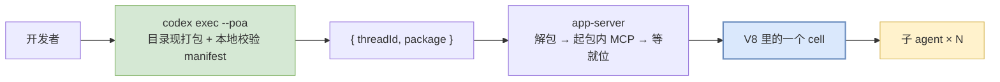
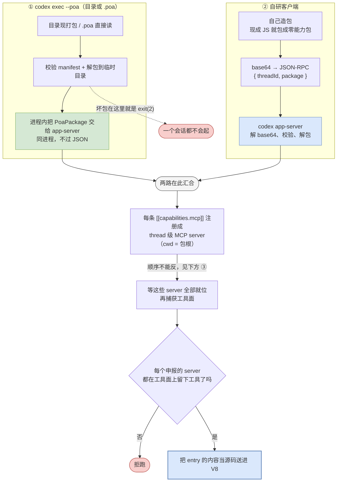

# 打包与分发

本篇讲把一段能跑的 JS 变成一个可分发的 `.poa` 包。写程序本身见《05-writing.md》文档，这里只讲打包这一段。

**前提**：跑包需要本项目构建的 `codex`，上游安装版没有这个入口。收件方的完整环境要求见 §6。

---

## 1. 代码是怎么进到沙箱里的

排障的第一步是判断失败落在哪一侧，所以先看这条链。



**①** 改程序不需要重建二进制，也没有"先 build 再跑"这一步。`codex exec --poa <目录>` 每次现打包，`entry` 是运行时被读成字符串送进去的。

**②** 协议层只有一种形状：`{ threadId, package }`。自研客户端走 `codex app-server` 的 `thread/codeMode/exec`，发的是同一个东西，只是包由它自己造、base64 之后过 JSON-RPC。只持有一段 JS 时也要现场封装成一个申报零能力的包，接口没有另一个只收源码的入口。

**③** `entry` 原样提交，前面不会拼入任何内容，所以首行 pragma 天然在第 1 行。pragma 不在第 1 行时静默失效。

**④** 报错落在哪一侧决定去哪查。坏包在本地就被拒，`codex` 自己报错并 `exit(2)`，一个会话都不会起；V8 侧的失败在返回的内容里。

---

## 2. 程序必须能独自跑完

当前这条通道上没有任何人工介入点，有两个并列的原因：

- 服务端发回来的请求由客户端代答，不经过人
- 程序没有跟人对话的手段。那个能向用户提问的内置工具只给模型，程序调不到，三道门每一道单独就足以挡死

`codex exec` 还把审批策略钉成 `never`，这一层压在 `-c approval_policy=...` 之上。

但这不构成保护：在 cell 里，任何走到"向人提问"或"等审批回执"这一步的调用都是无限挂死，与审批策略无关。回执要登记在一次模型回合上，而 cell 从不建立回合。所以 PoA 程序必须能在没有人的情况下从头跑到尾——需要人判断的地方，只能把判断也写成代码（比如数票），或者把问题留到最后输出里。最常见的触发源是没写 annotations 的 MCP 工具，见 §4.2。

---

## 3. 写一个包

程序可以像一个安装包那样，把自己要用的 MCP server 带在身上。能力申报写在包的 `manifest.toml` 里，服务端解包后按 thread 把它们起起来，不需要事先在宿主的 `config.toml` 里配好。能自带到什么程度见 §5。

### 3.1 目录结构

```
my-poa/
├── manifest.toml       [poa] 元数据 + [[capabilities.mcp]] 能力申报
├── main.js             程序本体，原样提交
└── mcp/echo.mjs        随包分发的 stdio MCP server，零依赖
```

`.poa` 就是这个目录打成的 zip，`manifest.toml` 必须在根上。派发部分怎么写见《05-writing.md》§12。

### 3.2 manifest 字段

```toml
[poa]
name = "echo_expert"              # 必填
version = "0.1.0"                 # 必填，格式不校验
runtime = "codex-v8"              # 必填，只认这一个值，其余值直接反序列化失败
poa_api_version = 1               # 必填，只认 1
entry = "main.js"                 # 必填，必须 .js/.mjs，必须在包内
description = "..."               # 可选

# 整段可以没有（不自带能力时），也可以重复多次（带多个 server）
[[capabilities.mcp]]
name = "echo"                     # 必填，只能用字母数字和 _ -，且不能与同包内其他 server 重名
type = "stdio"                    # 必填，只有这一种；写 network 会在解析阶段报错
shell = "node mcp/echo.mjs"       # 必填，按 shell 语法切成 argv，直接派生，不经 sh -c
description = "..."               # 可选

[[capabilities.mcp]]
name = "lookup"
type = "stdio"
shell = "node mcp/lookup.mjs"
```

以上是全部字段。其中两项需要单独说明：

- **没有 `env`。** 没有给 server 传 API key 之类凭据的入口，一个"需要凭据的 server"打不进包里。
- **未知字段被静默忽略，不报错。** manifest 没开严格模式，这是有意的：为了让"给更新版运行时写的 manifest"在 `runtime` 上失败，而不是在字段名上失败。拼错的字段名同样落在"未知字段"这一档。

### 3.3 提交之后发生了什么

两条路解包的地方不一样，排障时要分清：



**①** "组装在服务端"指的是起 server，不是解包。`codex exec --poa` 走的是进程内调用，包在客户端就打好、校验完、解压好了，`PoaPackage` 作为一个 Rust 值直接传进去，全程没有 base64、没有 JSON 序列化。base64 只发生在真正跨进程的 stdio JSON-RPC 上。

真正在服务端的是起 MCP server 这一段，它挂在 thread 级的扩展点上，所以任何前端只要能把包递进去就能复用。

**②** server 随 thread 生死，不写全局配置。包起的 server 只对这一个 thread 可见，`config.toml` 一个字都不改，thread 关掉进程就回收。

**③** 顺序不能反。包必须在"捕获工具面"之前发布，因为捕获工具面这一步才是建工具计划的时候。晚一步注册的 server，对这个 cell 来说等于不存在。

**④** 起不来即拒跑。判据是"这个 server 有没有在工具面上留下工具"，所以起来了但一个工具都不报的 server 同样算缺席。这是刻意与采样循环相反的选择：模型少一个工具可以改走别的路径，程序不能。启动超时 30 秒。

---

## 4. 两项必做处理

### 4.1 从 `ALL_TOOLS` 里找工具名，不要硬编码

`mcp__echo__echo` 是当前配置下的产物，前缀由宿主的命名规则决定，命名空间会被清洗、重名时还会加哈希后缀。正确写法是从 `ALL_TOOLS` 里按后缀找并断言唯一，完整写法与理由见《07-api-reference.md》§3.1。

### 4.2 给每个 MCP 工具写三条 annotations

标注写在 MCP server `tools/list` 返回里每个工具的 `annotations` 上：

```js
annotations: { readOnlyHint: true, destructiveHint: false, openWorldHint: false }
```

三个都要写，只写 `readOnlyHint` 不够：判定顺序是 `destructiveHint === true` 先短路（直接要审批），才轮到看 `readOnlyHint`。
标注还有一项附带作用：只读同时也是并行安全的判据，所以包自带的只读 server 是可以真并行的（包起的 server 那份配置里 `supports_parallel_tool_calls` 固定为 `false`，服务器级的整体豁免用不了，只能逐个工具标只读）。

> **缺 annotations 的工具在 cell 里是不可恢复的挂死，不是调用失败。**
>
> 判定为需要审批之后，宿主会去请一次审批回执，而这个回执必须登记在一次模型回合上——cell 从不建立回合，回执无处投递，那次工具调用的 promise 永不落地。钉死的是整条 `thread/codeMode/exec` RPC，客户端跟着一起卡。
>
> `yield_time_ms` 兜不住它，MCP 侧那 300 秒的默认超时也在挂点的下游、不会被触发。唯一的处置是杀进程。
>
> 同一个不带 annotations 的工具放进普通 turn 或子 agent 里可以走通——那里有回合，回执投得进去。

一个零依赖、手写 stdio JSON-RPC 的最小 server 是这样的（stdin 逐行读请求，stdout 逐行写响应），可以直接照抄：

```js
// mcp/echo.mjs —— 零依赖 stdio MCP server 的最小骨架
const TOOLS = [{
  name: "echo",
  description: "回显传入的文本",
  inputSchema: { type: "object", properties: { text: { type: "string" } }, required: ["text"] },
  annotations: { readOnlyHint: true, destructiveHint: false, openWorldHint: false },
}];

const send = (msg) => process.stdout.write(JSON.stringify(msg) + "\n");

let buf = "";
process.stdin.on("data", (chunk) => {
  buf += chunk;
  let i;
  while ((i = buf.indexOf("\n")) >= 0) {
    const line = buf.slice(0, i).trim();
    buf = buf.slice(i + 1);
    if (!line) continue;
    const req = JSON.parse(line);
    if (req.method === "initialize") {
      send({ jsonrpc: "2.0", id: req.id, result: {
        protocolVersion: "2024-11-05",
        capabilities: { tools: {} },
        serverInfo: { name: "echo", version: "0.1.0" },
      }});
    } else if (req.method === "tools/list") {
      send({ jsonrpc: "2.0", id: req.id, result: { tools: TOOLS } });
    } else if (req.method === "tools/call") {
      const text = String(req.params?.arguments?.text ?? "");
      send({ jsonrpc: "2.0", id: req.id, result: {
        content: [{ type: "text", text }],
        isError: false,
      }});
    } else if (req.id !== undefined) {
      send({ jsonrpc: "2.0", id: req.id, error: { code: -32601, message: "unknown method" } });
    }
    // 没有 id 的是通知（如 notifications/initialized），不回
  }
});
```

要点：`tools/list` 里每个工具都要带上面那三条 annotations；`tools/call` 的返回必须有 `content` 数组；带 `id` 的请求都要回，宿主会一直等到响应到达。`shell` 写成 `node mcp/echo.mjs`，因为解出来的文件权限固定 `0644`，可执行位不保留。

---

## 5. 包能带什么，不能带什么

| 能 | 不能 |
| --- | --- |
| `stdio` MCP server | `network` 传输（解析阶段拒，不是静默忽略） |
| 任意随包文件 | `[build]` 段、resources |
| 根线程的工具面 | 子 agent 的工具面——它跑在自己的 thread 上，拿不到包里的 server |

还有几个数字：包上限 64 MiB（因为要 base64 塞进一条 JSON-RPC 消息），解压后 256 MiB / 100 倍膨胀比 / 4096 个条目三道闸，解出来的文件权限固定 `0644`（所以 server 要写成 `node mcp/xxx.mjs` 这种带解释器的命令行，不能依赖可执行位）。

不派 agent 的包不需要真 provider——包本体不采样，`config.toml` 里的 provider 配置写什么都跑得完。派了 agent 的包才需要。

---

## 6. 打成一个文件发给别人

平时不需要打包，`codex exec --poa <目录>` 每次现打。只有"给别人一个文件"时才需要一个 `.poa`：

```bash
cd my-poa && zip -r ../my-poa.poa . && cd ..
codex exec --poa ./my-poa.poa          # 打好的包也照跑
```

`.poa` 就是一个普通 zip，唯一的要求是 `manifest.toml` 在根上——所以要在包目录**里面**打，不能 `zip -r my-poa.poa my-poa/`。

> [!CAUTION]
> **自己打的 zip 和 codex 现打的包，选文件的规则可能不一样。**
> `codex exec --poa <目录>` 显式关掉全部 ignore 规则，目录里有什么就打什么。`zip -r . ` 也是如此。
>
> manifest 申报的 server 文件没进包时，收件方看到的是
> `refusing to run: required MCP server(s) unavailable`。发包前打一份、再 `codex exec --poa ./x.poa` 跑一遍，是唯一可靠的验证。

解包时文件权限被无条件覆盖成 `0644`，所以打包时的权限位不影响结果。

### 收件方需要什么

`.poa` 文件本身不自足，对方的环境要满足四项：

| 项 | 说明 |
| --- | --- |
| `codex` 与 `codex-code-mode-host` 两个二进制 | 必须在同一目录，codex 按自己所在目录去找后者。获取方式见《02-quickstart.md》§0 |
| `[features.code_mode] enabled = true` | 写在对方 `CODEX_HOME` 的 `config.toml` 里。这个 feature 默认关闭，`--poa` 不会自动打开它 |
| 包里 server 需要的解释器 | `shell = "node mcp/echo.mjs"` 是在宿主进程里直接派生的，对方机器上得有 `node` |
| provider 配置 | 只在包会派子 agent 时需要。不派 agent 的包不采样，无需配置 |

对方拿到之后的命令：

```bash
codex exec --poa ./x.poa
```

工作目录不在 git 仓库里时要加 `--skip-git-repo-check`。
